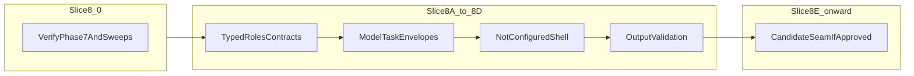

# Phase 8 — Specialized Model Pipeline (working plan)

**Plan id:** `1b9d495c`  
**Canonical path:** [`.cursor/plans/phase_8_specialized_model_pipeline_1b9d495c.plan.md`](phase_8_specialized_model_pipeline_1b9d495c.plan.md)  
**Phase contract (read-only reference):** [`docs/phases/graph_clerk_phase_8_specialized_model_pipeline.md`](../../docs/phases/graph_clerk_phase_8_specialized_model_pipeline.md)

This file is the **Cursor working plan** for Phase 8. It does **not** change phase governance; early slices intentionally **narrow** scope versus the full phase doc until contracts and validation exist.

**PM / tracking:** Use the YAML **todos** above (and the slice checklist further down) as the execution backlog. When a slice ships, set its todo `status` to `completed` and tick the matching **Slice progress** row; keep `phase8-pm-reconcile` in sync or mark it `completed` only when you intentionally end a PM pass (otherwise leave `pending` as a standing reminder).

---

## Phase purpose

Introduce a **governed, typed, testable boundary** for future **specialized model helpers** (classification, extraction, routing assistance only where outputs remain typed, bounded, traceable). Models assist **adapters and proposals**; they do **not** replace FileClerk, graph/evidence traceability, or `source_fidelity` semantics.

---

## Non‑negotiable invariants and rules

### Invariant: model output is not evidence

Anything produced by a model helper is **derived** or **candidate** metadata unless and until it is normalized through **existing** evidence contracts, ingestion/FileClerk boundaries, and **`source_fidelity`** semantics. Model output must **never** silently become source truth or substitute for selected `RetrievalPacket` evidence.

### Explicit rules (all slices)

- **No** `POST /answer` / answer synthesis in GraphClerk retrieval or this pipeline unless a **future**, separately approved phase explicitly scopes it.
- **No** default LLM calls: core paths stay local‑first; any inference adapter is **opt‑in**, explicit, and off by default (NotConfigured / explicit errors).
- **No retrieval mutation:** no changes to how routes are chosen, evidence is ranked, packets are assembled, or `RetrievalPacket` evidence semantics.
- **No evidence mutation:** no rewriting, silent enrichment, or replacement of `EvidenceUnit` text or packet source evidence from model output.

---

## Entry conditions (planning / implementation gate)

- **Phase 5:** remains **partial** / audit **`pass_with_notes`** (multimodal honest partials; no OCR/ASR/caption/video completion claimed).
- **Phase 6:** **`pass_with_notes`** baseline accepted per `docs/status/*` and Phase 6 audit.
- **Phase 7:** baseline **implemented** / audit **`pass_with_notes`** on record; **Slice 7I** (deterministic context boosting) **deferred/cancelled** pending separate approval.
- **Pre‑Phase‑8:** structural verification report exists; follow‑up remediation referenced there; code cleanliness sweep shows **no Severity A** blockers; language metadata key duplication remediated (e.g. commit `a0b9e20` or equivalent).
- **Phase 8:** **baseline** slices **8A–8G** may be **delivered** per `docs/status/*` (**not** full phase-doc product); **Slice 8I audit pending**.
- **Phase 9:** **`not_started`** unless/until explicitly kicked off.
- **Honesty:** status docs and README must not claim Phase 8 product features (registry, routing, inference) until implemented and tested.

---

## Non‑scope (Phase 8 kickoff and early slices)

- Model **training** or fine‑tuning.
- **Answer synthesis** or **`/answer`**.
- **Default** or hidden **LLM** dependencies or calls.
- Changing **`RetrievalPacket`** evidence semantics or selected evidence payloads.
- **FileClerk** bypass; graph/index **persistence** from raw model output.
- **Phase 9** IDE integration.
- **Frontend** work unless a later slice is explicitly scoped (not required for kickoff).

---

## Risks

| Risk | Mitigation |
|------|------------|
| Phase doc scope is **broad** (registry, UI, Ollama, etc.) vs early **contract‑only** work | Sequence **8A→8D** before integration; treat phase doc “components” as **later** slices unless approved. |
| Accidental **coupling** to `FileClerkService`, `retrieval_packet_builder`, or routes | **Forbidden imports** in early modules; code review + contract tests that only exercise boundaries. |
| Model JSON treated as **evidence** | Enforce **candidate/derived** labeling in schemas (8B); validation service (8D); no persistence without normalization (8E gated). |
| **Dependency creep** (Ollama, vLLM, etc.) | **8G** design‑only unless separately approved; **no** `pyproject` / requirements changes without approval. |

---

## Testing expectations

| When | Expectation |
|------|-------------|
| **This kickoff** (plan + optional status pointer only) | **No** `pytest` / frontend build required — **no** `backend/**` or `frontend/**` changes. |
| **Slice 8A** (future) | Add `backend/tests/test_phase8_model_pipeline_contracts.py`; run `python -m pytest` from `backend/`; keep integration tests env‑gated as today. |
| **Later slices** | Contract tests + failure cases per slice; no claiming “tested” in status without running the relevant suite. |

---

## Status‑doc expectations

- Keep **Phase 5** partial / **`pass_with_notes`**; **Phase 6** **`pass_with_notes`**; **Phase 7** **`pass_with_notes`**; **Phase 9** **`not_started`**.
- Keep **`POST /answer`** deferred; keep **OCR/ASR/caption/video** absent as today.
- **Phase 8:** document **`baseline implemented`** + audit **`pass_with_notes`** ([`docs/audits/PHASE_8_AUDIT.md`](../../docs/audits/PHASE_8_AUDIT.md)) vs **full phase-doc scope** (registry, production inference, UI); do **not** claim **`pass`** (unconditional) or production inference from baseline alone.
- Do **not** claim production inference, registry, or **`/answer`** from Phase 8 baseline alone.

---

## First implementation slice recommendation

**Slice 8A — Specialized model boundary contracts** only: typed roles/interfaces, no inference, no new dependencies, no retrieval or evidence paths touched. Await **explicit** task approval before editing `backend/**`.

---

## Slice checklist (8.0 — 8I)

| Slice | Name | Notes |
|-------|------|--------|
| **8.0** | Entry gate + plan alignment | Verify Phase 7 `pass_with_notes`, pre‑Phase‑8 sweeps, no Severity A cleanliness blockers; publish this plan; **no** backend code. |
| **8A** | Specialized model boundary contracts | Typed model roles/interfaces only; **no** real model calls; **no** inference; **no** dependency adds; **no** retrieval behavior changes. |
| **8B** | ModelTask schema / envelopes | Typed input/output contracts; status/error semantics; explicit **derived** / **candidate** labeling; **no** persistence unless separately approved. |
| **8C** | NotConfigured model adapter shell | Adapter protocol; NotConfigured raises **explicit** error; deterministic **test** adapter only; **no** real model. |
| **8D** | Model output validation service | Validates typed outputs; rejects unbounded prose where structured output is required; rejects source‑truth claims; **no** FileClerk integration yet. |
| **8E** | Candidate‑only integration seam | **Approval‑gated:** helpers may produce **candidate metadata only**; **no** `EvidenceUnit` text mutation; **no** `RetrievalPacket` source evidence mutation; **no** route/evidence ranking change. **Slice 8E (projection-only):** `ModelPipelineCandidateMetadataProjectionService` landed — validated envelope → `graphclerk_model_pipeline` subtree only; **no** ingestion/enrichment wiring yet. |
| **8F** | Evaluation fixtures | Deterministic fixtures + failure cases; **no** production inference. **Implemented:** `backend/tests/fixtures/phase8_model_pipeline_cases.py` + `backend/tests/test_phase8_model_pipeline_evaluation_fixtures.py`. |
| **8G** | Optional local inference adapter design | Design only (Ollama/vLLM/etc.); **no** dependency add without approval. **Design delivered (2026‑05‑01):** § Slice 8G below — default **E** until use case; first optional implementations **A** then **B**; **C/D** deferred. |
| **8H** | Docs/status update | Document what Phase 8 **is / is not**; no claim of model implementation or answer synthesis until true. **Done:** README + `docs/status/*` + phase doc **Implementation status** + honesty constraints (**2026‑05‑01**). |
| **8I** | Phase 8 audit | Artifact [`docs/audits/PHASE_8_AUDIT.md`](../../docs/audits/PHASE_8_AUDIT.md) — **`pass_with_notes`** (**2026‑05‑03**). |

### Slice progress (planning tracker)

- [x] **8.0** — Entry gate + plan alignment (working plan created; kickoff docs‑only).
- [x] **8A** — Boundary contracts (`backend/app/services/model_pipeline_contracts.py` + `backend/tests/test_phase8_model_pipeline_contracts.py`; contracts only, no adapters).
- [x] **8B** — Request/response envelopes (`ModelPipelineRequestEnvelope`, `ModelPipelineResponseEnvelope`, `ModelPipelineError`; status/error semantics; no adapters).
- [x] **8C** — Adapter shell (`ModelPipelineAdapter`, `NotConfiguredModelPipelineAdapter`, `DeterministicTestModelPipelineAdapter` tests-only; no registry, no real inference).
- [x] **8D** — Output validation service (`model_pipeline_output_validation_service.py`; deep recursive checks; reports only, no mutation).
- [x] **8E** — Candidate seam (**projection-only Option A** — `model_pipeline_candidate_projection_service.py` + tests; merge into candidates / enrichment deferred per § Slice 8E).
- [x] **8F** — Evaluation fixtures (`tests/fixtures/phase8_model_pipeline_cases.py`, `test_phase8_model_pipeline_evaluation_fixtures.py`; no adapter execution in fixtures).
- [x] **8G** — Local inference design only (§ Slice 8G — optional **A/B** adapters; **E** default; **no** code in this slice).
- [x] **8H** — Docs/status alignment (`README.md`, `docs/status/*`, phase doc baseline vs north-star).
- [x] **8I** — Phase 8 audit (`docs/audits/PHASE_8_AUDIT.md` — **`pass_with_notes`**).

---

## Slice 8E — Design notes (candidate-only integration seam)

**Status:** Design notes below remain canonical for enrichment/ingestion wiring. **Implementation (2026‑05‑01):** pure **`ModelPipelineCandidateMetadataProjectionService`** (`backend/app/services/model_pipeline_candidate_projection_service.py`) + `backend/tests/test_phase8_model_pipeline_candidate_projection_service.py` — projection metadata subtree only; **no** FileClerk, ingestion, enrichment, API, DB, or adapter calls inside projection. Optional merge paths (**B/C**) remain **not implemented**.

### PM recommendation — option letter

| Choice | Verdict |
|--------|---------|
| **A** — Pure projection service: validated pipeline output → namespaced **`graphclerk_model_pipeline`** metadata blob **only**; **no** ingestion wiring in the same slice | **Preferred first implementation** |
| **B** — Thin `EvidenceEnrichmentService` path that merges **only** a pre-built projection (still **no** adapter calls inside enrichment) | **After A + after 8F** |
| **C** — Direct merge in `TextIngestionService` / `MultimodalIngestionService` | **Avoid first** — coupling + persistence pressure |
| **D** — Defer all **8E** until **8F** | **Partial only:** defer **merge into candidates / enrichment** until **after 8F**; pure **A** may still ship earlier **without** ingestion touch |
| **E** — Other minimal (e.g. explicit `ProjectionOk` / `ProjectionRejected` ADT) | Same boundary as **A** |

**Smallest safe slice:** **A** (pure module + tests), **no** enrichment/ingestion edits until **8F** fixtures exist.

### Sub-agent summaries (this design pass)

- **PM:** Sequence **8F before E2 wiring**; split **E1** projection vs **E2** optional enrichment merge if scope creeps.
- **Code quality:** All Phase 8 writes under **`metadata_json["graphclerk_model_pipeline"]`**; **`proposed`** subtree only for model-suggested fields; projection imports **no** FileClerk/retrieval.
- **Audit:** Namespace + **`validation.ok`** + **no** `text` / `source_fidelity` mutation prevents treating model JSON as evidence; document honest limits in **8H**.
- **Testing:** Golden fixtures from **8F**; clone candidates and assert **`text`/`source_fidelity` unchanged**; **`validation.ok` false** → **no** merge; unavailable adapter → **no** metadata by default.
- **Git:** Plan file only unless implementation follows.

### Design Q&A (required)

1. **Seam:** **`ModelPipelineCandidateMetadataProjection`** service (name TBD): validated envelope + report → **`dict | None`** for the **`graphclerk_model_pipeline`** subtree only.
2. **Inputs:** Success **`ModelPipelineResponseEnvelope`** + **`ModelPipelineOutputValidationReport.ok`** + **`model_pipeline_request_id`**; optionally extracted **`ModelPipelineResult`**.
3. **Outputs:** **Metadata only** — mergeable nested dict; **never** mutates candidate evidence fields.
4. **New candidates:** **Out of scope** for minimal **8E**; defer unless separately approved.
5. **Future `source_fidelity` if new candidates ever allowed:** **`derived`** / **`computed`** only; never **`verbatim`** for model body text.
6. **Traceability:** Include **`schema_version`**, **`model_pipeline_request_id`**, **`role`**, **`output_kind`**, **`status`**, **`provenance.source`**, **`validation`** (`ok` + compact **`issues`**), **`proposed`**.
7. **`ModelPipelineOutputValidationService`:** Runs **before** projection; projection **refuses** if **`ok`** is false.
8. **Validation fails:** **No merge**; **no** silent attach (quarantine/logging **deferred**).
9. **Adapter unavailable:** **No** candidate metadata by default (matches **NotConfigured** behavior).
10. **8E vs 8F:** **8F before any enrichment/ingestion wiring**; **pure A** may precede **8F** if it stays **off** ingestion paths.
11. **Enrichment vs standalone:** **Standalone A first**; optional enrichment hook (**B**) only after **8F**, default remains **no-op** in production.
12. **Allowed files (future impl, illustrative):** `backend/app/services/model_pipeline_candidate_projection_service.py`, `backend/tests/test_phase8_model_pipeline_candidate_projection*.py`; later optionally **`evidence_enrichment_service.py`** for thin merge. **Forbidden until approved:** `text_ingestion_service.py`, `multimodal_ingestion_service.py`, FileClerk/retrieval/route/evidence selection, API, DB, adapters in enrichment default path.
13. **Tests:** Projection golden JSON; reject paths; immutability on cloned candidates; import boundaries.
14. **Deferred:** Orchestrator calling adapters; new EU candidates from models; UI; quarantine store.

### Canonical metadata shape (`metadata_json`)

```json
{
  "graphclerk_model_pipeline": {
    "schema_version": "phase8.v1",
    "model_pipeline_request_id": "...",
    "role": "evidence_candidate_enricher",
    "output_kind": "candidate_metadata",
    "status": "success",
    "provenance": { "source": "deterministic_test" },
    "validation": { "ok": true, "issues": [] },
    "proposed": { "labels": [], "hints": [] }
  }
}
```

---

## Slice 8G — Design notes (optional local inference adapters)

**Status:** **Design-only** (2026‑05‑01). **No** adapter implementation, **no** new dependencies, **no** `backend/app/**` edits in this slice. **Implementation remains disallowed** until a separate, explicit approval names a concrete helper use case (role + output contract + evaluation path).

**Posture:** Prefer **`NotConfiguredModelPipelineAdapter` + deterministic test adapter** (**option E**) as the **only** shipped paths until then. When inference is approved, design targets **HTTP-local servers** first: **A (Ollama)** as the **default first optional adapter**, **B (vLLM OpenAI-compatible)** as the **peer alternate** for deployments that already standardize on OpenAI-shaped APIs. Treat **C** and **D** as **explicitly deferred** for Phase 8’s first wave (see deferral table).

### Option comparison (local inference backends)

| Criterion | **A — Ollama HTTP** | **B — vLLM OpenAI-compatible HTTP** | **C — llama.cpp / CLI** | **D — transformers in-process** | **E — NotConfigured + deterministic tests only** |
|-----------|---------------------|-------------------------------------|-------------------------|--------------------------------|--------------------------------------------------|
| **Local-first fit** | Strong: daemon on localhost, typical dev laptop setup | Strong when vLLM already runs locally/cluster | Moderate: binary + model files; subprocess coupling | Weak–moderate: Python/GPU/env heavy | Perfect: no runtime inference |
| **Dependency weight** | Low client-side (HTTP + stdlib or existing HTTP stack); **no** weight if not configured | Same pattern as A if using generic HTTP client | Low Python deps; **high** operational coupling to CLI/version | **Very high** (`torch`, CUDA, model blobs) | **Zero** additional inference deps |
| **Operational complexity** | Low–moderate: install service, pull model, keep version pinned | Moderate–high: server flags, GPU drivers, capacity | High: process management, quoting, streaming quirks | Very high: CUDA, VRAM, batching, security patches | **Minimal** |
| **Deterministic testing** | Good: mock HTTP; optional gated integration | Good: mock OpenAI-shaped responses | Poor: subprocess/flaky timing, snapshot drift | Poor: hardware/non-determinism unless heavily mocked | **Excellent** |
| **JSON / structured output** | Via prompting + parse; native “format” varies by model/API version | Similar; OpenAI JSON mode where supported — still **must** validate | Fragile without strict server-side contract | Same as D — manual parse | N/A (typed fixtures) |
| **Failure semantics** | HTTP errors, 4xx/5xx, empty body → typed **`ModelPipelineResponseEnvelope`** (`error`, `retryable` rules TBD in impl slice) | Same | Process exit codes, stderr parsing — messy mapping | OOM, CUDA errors — hard to classify | Clean **`unavailable`** / explicit errors |
| **Timeout / cancellation** | **Required:** client timeout per request; optional cancel via dropping connection | Same | Harder (kill subprocess tree) | Harder (async cancel + GPU work) | N/A |
| **Security / sandboxing** | Network to localhost only by default; deny non-loopback unless explicitly configured | Same | Subprocess escape surface; argv injection risk | Large attack surface (pickles, deps) | None added |
| **Windows compatibility** | **Good** (Ollama supports Windows) | Variable (vLLM historically Linux-first; verify target matrix before impl) | Moderate (binaries exist; PATH/WSL friction) | Moderate–hard (CUDA on Windows) | **Universal** |
| **Keep model output non-evidence** | Same governance: validation + projection only; **no** EU/`text`/`source_fidelity` mutation | Same | Same risk as any backend if callers bypass gates | Highest creep risk (easy to “just generate”) | **Easiest to enforce** |
| **Risk of `/answer` creep** | Medium if prompts unconstrained | Medium | Medium–high (CLI “ask anything”) | **High** (general LM in-process) | **Lowest** |

### Recommendation summary

1. **Recommended first (when inference is approved):** **A — Ollama HTTP** — simplest mental model for **local-first** developers, **Windows-friendly**, **mockable** HTTP surface, **no** in-process GPU stack in GraphClerk.
2. **Peer alternate (same approval gate):** **B — vLLM OpenAI-compatible** — choose when operations already run an OpenAI-compatible local server and want one client shape.
3. **Explicitly defer (Phase 8 first adapter wave):** **C — llama.cpp / CLI wrapper** (operational + test brittleness; security/process ergonomics) and **D — transformers / local Python runtime** (dependency weight, determinism, **`/answer` creep**, GPU ops burden).
4. **Until a concrete use case + approval:** **E — keep only `NotConfigured` + deterministic test adapters** — satisfies “unsure → default E” and avoids silent Phase 8 scope expansion.

**This task does not approve implementation.**

### Design Q&A (required)

1. **Which adapter option is recommended first and why?** **E** remains the **shipping default**. For the **first optional real adapter** after approval, prefer **A (Ollama)** for **local-first fit**, **low coupling**, **Windows compatibility**, and **clean HTTP mocking** in tests. Use **B** when the deployment standard is already OpenAI-compatible HTTP to vLLM (or similar).
2. **Which adapter option should be explicitly deferred?** **C** (CLI/subprocess) and **D** (in-process transformers/torch) for the **first** GraphClerk Phase 8 inference slice — defer until governance explicitly accepts their ops cost and **`/answer`** risk.
3. **What request/response shape should it consume/produce?** **Consume:** existing **`ModelPipelineRequestEnvelope`** (task.role, task.output_kind, bounded **`task.payload`** / **`task.metadata`** — no raw prompt dumps in the envelope unless a future slice adds an explicit, reviewed field). **Produce:** **`ModelPipelineResponseEnvelope`** only (`success` + **`ModelPipelineResult`** or non-success + **`ModelPipelineError`**), **`schema_version`** carried through.
4. **How does raw model HTTP JSON map into `ModelPipelineResponseEnvelope`?** Adapter owns a **private parse step**: HTTP layer → extract assistant text or server-specific JSON → **normalize into role-aligned `ModelPipelineResult.payload` dict** (JSON-like) + **`provenance`** (`source`: `ollama` | `vllm`, `model`, optional ids/timings). On parse/shape failure → **`ModelPipelineStatus.error`** with **`ModelPipelineError`** (`code`, `message`, `retryable`, **`details`** JSON without truth claims). On transport/upstream down → **`unavailable`** or **`error`** per policy table (implementation slice).
5. **How are timeouts represented?** Client-side **deadline** (e.g. **`GRAPHCLERK_MODEL_PIPELINE_TIMEOUT_SECONDS`** when implemented). On expiry → **`ModelPipelineResponseEnvelope`** with **`error`** (or **`unavailable`** if classified as upstream overload — implementation must document one mapping); typically **`retryable: true`** for timeouts unless safety dictates otherwise.
6. **How are invalid JSON / malformed structured outputs represented?** **`ModelPipelineStatus.error`** + **`ModelPipelineError`** with stable codes such as **`model_pipeline_invalid_json`** / **`model_pipeline_schema_mismatch`**; **`details`** may include parser offset / snippet hash — **no** nested truth claims. Never fabricate **`success`** with partial payloads.
7. **How are unavailable model servers represented?** Connection refused / DNS / TLS to configured base URL → **`ModelPipelineStatus.unavailable`** (or **`error`** if distinguished — pick one convention in impl slice) + **`ModelPipelineError`** with **`retryable: true`** where appropriate; align with **`NotConfigured`** semantics: **no** silent success, **no** `result` payload on non-success envelopes (per **8B** rules).
8. **How are prompt templates governed?** **Out of band from ingestion:** versioned templates (module constants or checked-in template registry), **role-specific**, reviewed strings; **task.payload** supplies **structured slots** only (ids, labels, bounded excerpts). **Forbidden:** ad-hoc “answer the user” templates wired from retrieval endpoints — that is **`/answer`** scope creep. Prompt assembly stays **inside the adapter module** or a dedicated **`model_pipeline_prompts`** submodule (future allowlist).
9. **How are model outputs validated before projection?** **Mandatory pipeline:** `ModelPipelineOutputValidationService.validate_response(envelope)` → **`ModelPipelineOutputValidationReport`**; only if **`report.ok`** may **`ModelPipelineCandidateMetadataProjectionService.project`** run. **Adapter does not skip validation** and **projection never runs on raw strings**.
10. **How do we prevent model output from becoming evidence?** **Multiple gates:** (a) typed **`ModelPipelineResult`** only; (b) **8D** recursive validation rejects **`is_evidence`**, **`source_fidelity: verbatim`**, **`source_truth`**, and prose-shaped keys where disallowed; (c) **8E** projection places payloads under **`proposed`** in **`graphclerk_model_pipeline`** metadata only; (d) **no** adapter calls **FileClerk**, **retrieval**, **ingestion**, **no** **`EvidenceUnit`** creation, **no** mutation of **`EvidenceUnitCandidate.text`** or **`source_fidelity`** in the adapter slice.
11. **What config/env variables would be required later?** **Illustrative only (not set now):** e.g. **`GRAPHCLERK_MODEL_PIPELINE_ADAPTER`** (`ollama` \| `vllm` \| `not_configured`), **`GRAPHCLERK_MODEL_PIPELINE_BASE_URL`**, **`GRAPHCLERK_MODEL_PIPELINE_MODEL`**, **`GRAPHCLERK_MODEL_PIPELINE_TIMEOUT_SECONDS`**, optional **`GRAPHCLERK_MODEL_PIPELINE_API_KEY`** if local auth proxy added. Default unset → **`NotConfigured`** behavior.
12. **What files would be allowed if implementation is later approved?** **Illustrative:** new **`backend/app/services/model_pipeline_*_adapter.py`** (or single `model_pipeline_http_adapters.py`), optional **`model_pipeline_prompt_registry.py`**, thin **factory** selecting **`NotConfigured` vs HTTP adapter**, matching **`backend/tests/test_phase8_model_pipeline_*`**. Reuse **8F** fixtures where possible.
13. **What files remain forbidden?** Same Phase 8 gates as prior slices unless a future slice explicitly expands scope: **`backend/app/api/**`**, **`backend/app/models/**`**, **`backend/app/db/**`**, **`backend/app/repositories/**`**, **`file_clerk_service.py`**, **`retrieval_packet_builder.py`**, **`route_selection_service.py`**, **`evidence_selection_service.py`**, **`text_ingestion_service.py`**, **`multimodal_ingestion_service.py`**, **`evidence_enrichment_service.py`** (unless a separately approved **thin merge** slice), **`frontend/**`**, migrations — **no** wiring inference into **`/answer`**.
14. **What tests are required before implementation acceptance?** **Unit:** mocked HTTP client — success JSON → valid envelope; malformed JSON → **`error`**; timeout → classified outcome; connection failure → **`unavailable`/`error`**. **Contract:** role/output matrix violations still rejected by Pydantic. **Validation:** every mocked success path runs **`ModelPipelineOutputValidationService`**; failures never reach projection. **Import boundaries:** AST or grep tests — **no** FileClerk/retrieval/ingestion imports in adapter module. **Optional gated integration:** env-flagged live call against local Ollama/vLLM (off in CI default).

### Required boundaries (restated for future implementation)

- Adapter **`run(...) -> ModelPipelineResponseEnvelope`** only.
- **`ModelPipelineOutputValidationService`** runs **before** **`ModelPipelineCandidateMetadataProjectionService`** (callers or orchestrator enforce order).
- **No** persistence, **no** FileClerk, **no** retrieval services, **no** **`EvidenceUnit`** creation, **no** **`EvidenceUnitCandidate.text`** / **`source_fidelity`** mutation.
- **No** **`/answer`** implementation; inference **opt-in** and **off** by default; **`NotConfigured`** remains default when unset.

---

## Slice 8A — acceptance criteria (when implemented)

- Contracts exist for future **specialized model roles** (typed, bounded).
- Contracts **do not** call models or perform I/O.
- Contracts **do not** persist data.
- Contracts **do not** mutate evidence or `RetrievalPacket` contents.
- Contracts **do not** touch retrieval / FileClerk / route or evidence selection services.
- Tests prove modules are importable and enforce **basic** validation contracts.
- Full backend **`python -m pytest`** passes after 8A code lands.

**Allowed files (8A task scope, typical):** `backend/app/services/model_pipeline_contracts.py`, `backend/tests/test_phase8_model_pipeline_contracts.py`. **Avoid** `backend/app/services/errors.py` unless a narrowly scoped pipeline error type is unavoidable. **Forbidden:** `backend/app/api/**`, `backend/app/models/**`, `backend/app/db/**`, `backend/app/repositories/**`, migrations, `file_clerk_service.py`, `retrieval_packet_builder.py`, `route_selection_service.py`, `evidence_selection_service.py`, `text_ingestion_service.py`, `multimodal_ingestion_service.py`, `frontend/**`, `pyproject.toml`, `requirements*`, `.cursor/rules/**`.

---

## High‑level flow (reference)



---

## Sub‑agent Primary handoffs (this kickoff)

Summaries per `docs/governance/AGENT_ROLES.md` → **Dedicated sub‑agents** → **Handoff to primary / parent**.

### Project Manager Agent

1. **Mission recap:** Deliver Phase 8 working plan + optional status trace; sequence slices 8.0–8I; block premature inference/training.
2. **Scope touched:** `.cursor/plans/phase_8_specialized_model_pipeline_1b9d495c.plan.md`; optional `docs/status/PHASE_STATUS.md`.
3. **Drift / findings:** Entry gate satisfied per `docs/status/*`, Phase 7 audit, pre‑Phase‑8 reports; Phase 8 product code still **`not_started`**.
4. **Follow‑ups:** **Y** — user approves **Slice 8A** implementation task with file allowlist.
5. **Recommended next actions:** Implement **8A** only after explicit approval; run pytest for that slice.

### Status Documentation Agent

1. **Mission recap:** Preserve honesty; add plan pointer only for traceability.
2. **Scope touched:** `PHASE_STATUS.md` (if edited).
3. **Drift / findings:** Phase 5–7 and `/answer`/OCR honesty unchanged; Phase 8 remains **`not_started`** for implementation.
4. **Follow‑ups:** **N** unless implementation changes shipped behavior.
5. **Recommended next actions:** After future slices, update `PROJECT_STATUS` / `ROADMAP` if scope claims change.

### Audit Agent

1. **Mission recap:** Prevent overclaiming Phase 8 or Phase 9.
2. **Scope touched:** Plan + status diff (read).
3. **Drift / findings:** No Phase 8 product implementation claimed; 8I audit deferred until implementation exists.
4. **Follow‑ups:** **N** for kickoff.
5. **Recommended next actions:** Run Phase 8 audit checklist when closing **8I**.

### Code Quality Agent (read‑only)

1. **Mission recap:** Guardrail for future 8A purity.
2. **Scope touched:** N/A code in kickoff.
3. **Drift / findings:** Future `model_pipeline_contracts.py` must stay free of retrieval/FileClerk imports.
4. **Follow‑ups:** **Y** at 8A review.
5. **Recommended next actions:** Single contracts module; expand only with envelopes (8B).

### Testing Agent

1. **Mission recap:** Tests for kickoff vs 8A.
2. **Scope touched:** None executed (docs/plan only).
3. **Drift / findings:** Kickoff requires **no** test run.
4. **Follow‑ups:** **Y** when `backend/**` changes for 8A+.
5. **Recommended next actions:** Default `pytest` after 8A.

### Git Agent

1. **Mission recap:** Stage only allowed paths; commit; push `master`.
2. **Scope touched:** Plan file ± `PHASE_STATUS.md`.
3. **Drift / findings:** Do not stage `backend/**`, `frontend/**`, caches, or forbidden paths.
4. **Follow‑ups:** **N** after successful push unless remote rejects.
5. **Recommended next actions:** Verify `git status` clean except intentional untracked.
