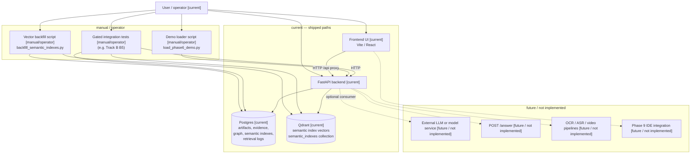
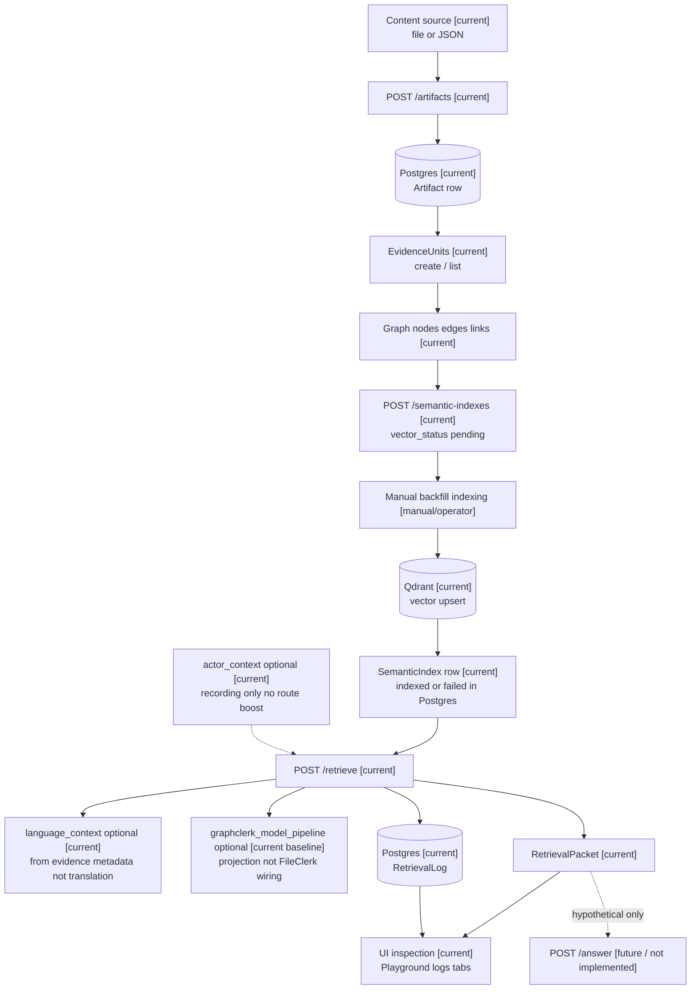

# GraphClerk — architecture overview

| Field | Value |
|-------|--------|
| **Doc status** | **Track F Slice F3** — as-built overview + narrative; **not** a production deployment runbook. |
| **Alignment** | Phases **1–8** completion-program / README / status honesty baseline. |
| **Phase 9** | **Not started** — any **Phase 9** or **IDE** attachment points below are **[future / not implemented]** only. |
| **Future branches** | Shown so readers see **where** optional work would attach — **not** a claim it exists. |

---

## Audience

Implementers and operators who need **one picture** of components, stores, APIs, UI, and **manual** indexing before reading phase docs or code.

---

## Architecture at a glance

GraphClerk is an **evidence-routing layer**: content enters via **`POST /artifacts`**, becomes **artifacts** and **evidence units** in **Postgres**; **graph** structure and **semantic index** rows are also **Postgres**; **vectors** for semantic search live in **Qdrant** (`semantic_indexes` collection). **`POST /retrieve`** (File Clerk) reads Postgres + Qdrant (when semantic search runs), returns a **`RetrievalPacket`**; **`RetrievalLog`** snapshots may persist in **Postgres**. The **React UI** calls the same HTTP API. **Moving vectors from “pending” to Qdrant** is **[manual/operator]** today (backfill script or equivalent), **not** automatic on `POST /semantic-indexes`. **External LLMs** and **`POST /answer`** are **outside** the current core product — **[future / not implemented]** attachment points only.

---

## Legend

| Label | Meaning |
|-------|---------|
| **`[current]`** | Shipped / as-built in this repository baseline. |
| **`[manual/operator]`** | Human or script step **outside** automatic API create paths (demo loader, vector backfill, verification). |
| **`[future / not implemented]`** | Planned or spec-only; **no** implementation claimed here. |

---

## As-built component diagram

**Mermaid** — labels include the legend tags where helpful.

**Solid lines (`-->`):** **[current]** or **[manual/operator]** paths that exist today. **Dotted lines (`-.->`):** **[future / not implemented]** — conceptual attachment only.

---

## Data flow diagram

**Mermaid** — main sequence from content to packet; optional fields called out.

**Notes on optional paths in the diagram:**

- **`actor_context`**: **[current]** request field; **does not** influence routing or evidence selection (recording only).
- **`language_context`**: **[current]** optional packet field from **evidence `metadata_json`** aggregates — **not** automatic translation.
- **`graphclerk_model_pipeline`**: **[current baseline]** typed **projection** on the packet when configured — **not** merged as evidence inside File Clerk / ingestion in the shipped baseline (see root `README.md` Phase 8).
- **`POST /answer`**: dotted **[future / not implemented]** — no endpoint in this repo today.

---

## Runtime stores

### Postgres **[current]**

Canonical application data, including:

- **Artifacts** and **evidence units** (ingestion output; `metadata_json` where used).
- **Graph** nodes, edges, and evidence link rows.
- **Semantic indexes** and entry-node associations; **`vector_status`** is stored here and must stay **consistent** with successful Qdrant upserts for honest **`indexed`** / **`failed`** semantics.
- **Retrieval logs** (best-effort snapshots, pagination via API).

### Qdrant **[current]**

- Collection **`semantic_indexes`** (vector size must match the **embedding adapter dimension** in use — often **8** for dev **`DeterministicFakeEmbeddingAdapter`** / backfill script).
- **Vectors** are **not** auto-created on `POST /semantic-indexes`; **`vector_status`** in Postgres reflects operator/indexing outcomes.

### Filesystem / scripts **[manual/operator]**

- **Demo corpus** files consumed by the loader script; **artifact storage** paths configured for the API (not detailed in this overview).
- **Backfill script** at repo `scripts/` — **no** hidden model artifacts in core paths; deterministic dev embeddings per script docstring.

---

## API surfaces **[current]**

| Area | Role |
|------|------|
| **`GET /health`**, **`GET /version`** | Liveness and build metadata. |
| **`POST /artifacts`**, **`GET /artifacts*`** | Ingestion and artifact listing/detail. |
| **`GET /artifacts/{id}/evidence`**, **`GET /evidence-units/{id}`** | Evidence inspection. |
| **Graph** (`/graph/nodes`, `/graph/edges`, evidence link routes) | Structure + evidence attachment. |
| **`POST /semantic-indexes`**, **`GET /semantic-indexes*`, `/search`** | Index CRUD and **indexed-only** semantic search. |
| **`POST /retrieve`** | File Clerk → **`RetrievalPacket`**. |
| **`GET /retrieval-logs*`** | Log list and detail. |

**Explicit non-features (do not assume from this doc):**

- **`POST /answer`** — **not implemented.**
- **Automatic vector indexing** on semantic index create — **not implemented.**
- **Production model inference** inside **`POST /retrieve`** — **not wired**; Phase 8 ships **contracts** and **NotConfigured** defaults, not a production inference stack.

---

## UI surfaces **[current]**

| UI area | What it inspects **[current]** | What it does **not** prove |
|---------|-------------------------------|----------------------------|
| **Query Playground** | Live **`POST /retrieve`** packets, warnings, raw JSON. | Answer quality; hidden OCR/ASR. |
| **Artifacts & evidence** | Rows from artifact/evidence APIs. | Full multimodal extraction depth. |
| **Graph explorer** | Nodes, edges, links. | Automatic graph repair. |
| **Semantic indexes** | `vector_status`, `embedding_text`, entry nodes. | Auto-backfill or production embeddings. |
| **Retrieval logs** | Stored questions and packet snapshots when present. | Guaranteed logging on every request. |
| **Evaluation dashboard** | Evaluation flows per evaluation docs. | Ground-truth “correctness” of model outputs. |

---

## Manual operator steps **[manual/operator]**

| Step | Purpose | Doc links |
|------|---------|-----------|
| **Demo loader** | HTTP-driven seed of demo-shaped rows (`scripts/load_phase6_demo.py` from repo root). | [`docs/demo/PHASE_6_DEMO_CORPUS.md`](../demo/PHASE_6_DEMO_CORPUS.md) |
| **Manual vector backfill** | Move **`vector_status`** toward **`indexed`** (or honest **`failed`**) via script + **`DATABASE_URL`** / **`QDRANT_URL`**. | Same demo doc — *Manual vector indexing*; [`FEED_CONTENT_MINIMAL_GUIDE.md`](FEED_CONTENT_MINIMAL_GUIDE.md) Step 8 |
| **B5 / B5.1 style verification** | Gated integration proof of indexed retrieve path (when env set). | [`docs/governance/TESTING_RULES.md`](../governance/TESTING_RULES.md); [`docs/release/RELEASE_CHECKLIST.md`](../release/RELEASE_CHECKLIST.md) |
| **Qdrant dimension mismatch** | Dev Qdrant collection size vs adapter dim — operator reset of **`semantic_indexes`** only on disposable instances. | [`TESTING_RULES.md`](../governance/TESTING_RULES.md) — *Qdrant `semantic_indexes` vector dimension mismatch* |
| **Broad failure triage** | Symptoms vs expected vs bug; HTTP and runbooks. | [`TROUBLESHOOTING_AND_OPERATIONS.md`](TROUBLESHOOTING_AND_OPERATIONS.md) |

---

## Optional / future branches **[future / not implemented]**

The following are **tracked** by the [**Phase 1–8 completion program**](../plans/phase_1_8_completion_program.md) and/or **Phase 9 planning** (`docs/phases/` specs only for Phase 9) — **not** shipped claims:

- **OCR / ASR / video** as first-class evidence pipelines.
- **Production embedding provider** and **production model adapter** / registry / settings UI.
- **Model metadata merge** into ingestion, enrichment, or File Clerk evidence selection.
- **`POST /answer`** packet-only synthesis (Track **E**-class work if approved).
- **Phase 9 IDE integration** or other Phase 9 deliverables.

---

## What this diagram intentionally does not claim

- It does **not** claim **OCR / ASR / video** exists as implemented pipelines.
- It does **not** claim **production inference** exists in core retrieve.
- It does **not** claim **`POST /answer`** exists.
- It does **not** claim **automatic vector backfill** on semantic index create.
- It does **not** claim **Phase 9** has **started** implementation.
- It does **not** replace **`docs/status/*`**, audits, or phase deep-dives — it **summarizes** for onboarding.

---

## How this relates to other onboarding docs

| Document | Relationship |
|----------|----------------|
| [`GRAPHCLERK_PIPELINE_GUIDE.md`](GRAPHCLERK_PIPELINE_GUIDE.md) | **Concepts**, minimal vs rich, failure-mode table, integration patterns — **narrative** complement to this **architecture** page. |
| [`FEED_CONTENT_MINIMAL_GUIDE.md`](FEED_CONTENT_MINIMAL_GUIDE.md) | **Smallest** hands-on sequence (PowerShell templates) — **walks** the data flow above. |
| [`README.md`](README.md) (this folder) | Entry point and **Start here** ordering. |

---

## Next architecture / documentation work

| Track F slice | Intent |
|---------------|--------|
| **F4** | Expanded failure modes + Qdrant operator narrative (beyond links here). |
| **F5** | curl / Python examples cookbook. |

**Open decisions** (product owner / program): production embeddings, multimodal engines, **`/answer`**, Phase **9** scope — **not** resolved in this doc; see [`docs/plans/phase_1_8_completion_program.md`](../plans/phase_1_8_completion_program.md) §15 and status tables.
